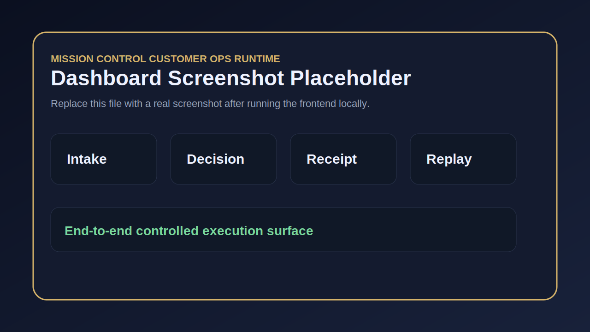

# Mission Control: Customer Operations Runtime

A working customer operations platform for workflow intake, evidence collection, review orchestration, governed execution status, audit trails, receipts, replay, controlled execution, and operational observability.

This is built as a Forward Deployed Engineering portfolio system: a customer-facing application that turns ambiguous operational requests into structured, reviewable, executable workflows.

> Demo media hooks are reserved under `assets/`. Add a dashboard screenshot at `assets/dashboard-screenshot.png` and a short demo GIF at `assets/demo-walkthrough.gif` after capturing the running app.

## Visual demo



A 20–40 second GIF should show:

```text
Dashboard -> request intake -> runtime decision -> review -> receipt -> replay -> audit trail
```

Recommended path:

```text
assets/demo-walkthrough.gif
```

## Why this system matters

Customer operations often fail at the boundary between approval and execution. A request may look valid at intake, but become unsafe or unauthorized before the action is actually released.

Mission Control makes that boundary explicit:

- removes ambiguity from customer operations
- evaluates authority, scope, evidence, risk, and review requirements
- prevents unsafe or unauthorized actions from executing silently
- creates replayable receipts for operational decisions
- gives teams a dashboard for intake, review, execution status, audit, and replay
- provides a deployable pattern for high-assurance AI-assisted operations

## Current state

This repo is no longer only a scaffold. It includes an end-to-end v0.4 runtime:

- FastAPI backend
- SQLAlchemy persistence
- SQLite default database
- customer and workflow APIs
- request evaluation API
- evidence attachment API
- review action API
- controlled execution endpoint
- persisted receipt endpoint
- persisted replay endpoints
- audit trail endpoint
- metrics endpoint
- correlation ID middleware
- dashboard API
- Next.js frontend dashboard
- Docker Compose deployment
- GitHub Actions CI
- smoke test script
- end-to-end API test

## Tech stack

```text
Backend: FastAPI, Python 3.11, Pydantic
Persistence: SQLAlchemy, SQLite default, PostgreSQL-ready path
Frontend: Next.js, React, TypeScript
Deployment: Docker, Docker Compose
Testing: pytest, FastAPI TestClient, smoke test script
Operations: CORS, correlation IDs, structured request logging, metrics endpoint
```

## Architecture

```text
Customer Operator
    |
    v
Next.js Dashboard
    |
    v
FastAPI Operations API
    |
    +--> Customer + Workflow Registry
    +--> Request Intake
    +--> Evidence Attachment
    +--> Runtime Policy Gate
    +--> Review / Escalation
    +--> Controlled Execution Guard
    +--> Receipt Service
    +--> Replay Service
    +--> Audit Trail
    +--> Metrics + Dashboard
    |
    v
SQLAlchemy Persistence Layer
```

## Operational path

```text
customer
  -> workflow
  -> request intake
  -> persisted request
  -> runtime decision
  -> review action
  -> controlled execution
  -> receipt
  -> same-condition replay
  -> changed-condition replay
  -> audit trail
  -> dashboard
```

## Concrete lifecycle example

### Scenario

Customer requests emergency access to a production system.

### Intake JSON

```json
{
  "customer_id": "demo-customer",
  "workflow_id": "security-exception",
  "request_id": "REQ-PROD-ACCESS-001",
  "requested_action": "grant_emergency_production_access",
  "business_context": "On-call engineer needs temporary production access to resolve an active incident.",
  "authority_present": true,
  "scope_matched": true,
  "evidence_present": true,
  "evidence_fresh": true,
  "risk_level": "critical",
  "approval_required": true,
  "metadata": {
    "incident_id": "INC-1042",
    "requested_duration_minutes": 30
  }
}
```

### Lifecycle

```text
1. Request submitted
2. Runtime detects critical risk
3. Outcome: ESCALATE
4. Lifecycle status: pending_approval
5. Reviewer approves
6. Lifecycle status: approved_for_execution
7. Controlled execution endpoint releases the action
8. Receipt generated
9. Same-condition replay matches
10. Changed-condition replay refuses inherited authorization posture
11. Audit trail records evaluation, review, execution, receipt, and replay
```

### Expected decision

```json
{
  "outcome": "ESCALATE",
  "protected_effect_status": "PENDING_HIGH_AUTHORITY_REVIEW",
  "no_bind_status": true,
  "reason_codes": [
    "AUTHORITY_PRESENT",
    "SCOPE_MATCHED",
    "EVIDENCE_PRESENT",
    "EVIDENCE_FRESH",
    "RISK_CRITICAL",
    "CRITICAL_RISK_ESCALATION"
  ]
}
```

## What this system does

1. Customer submits an operational request.
2. System creates a structured request envelope.
3. Evidence and context can be attached.
4. Runtime policy evaluates readiness and risk.
5. Review routing determines whether human action is required.
6. Outcome becomes `ADMIT`, `HOLD`, `ESCALATE`, or `REFUSE`.
7. Controlled execution is blocked unless lifecycle state permits release.
8. Receipt is generated.
9. Replay verifies same-condition and changed-condition behavior.
10. Audit trail records material events.
11. Dashboard exposes operational state.

## Example use cases

- Vendor onboarding
- Payment approvals
- Security exceptions
- Change management
- Customer operations
- Compliance workflows
- AI-assisted operational decisions
- Emergency access review
- Production change approval

## Forward Deployed Engineering Signals

- Customer workflow intake
- FastAPI backend
- Production-oriented API design
- Structured request schemas
- Runtime policy gate
- Review and escalation logic
- Controlled execution guard
- Receipt and replay system
- Persistent audit trail
- Dockerized deployment
- Frontend dashboard
- Customer discovery docs
- Seeded demo cases
- CI and tests

## Quickstart: Docker

```bash
docker compose up --build
```

Open:

```text
Frontend: http://localhost:3000
API docs: http://localhost:8000/docs
Health: http://localhost:8000/health
Metrics: http://localhost:8000/metrics
```

Expected API health output:

```json
{
  "status": "ok",
  "service": "mission-control-customer-ops-runtime",
  "mode": "customer-operations-platform"
}
```

In the frontend, click:

```text
Seed Demo Customer
```

Then submit a customer request and inspect decision, review action, receipt, replay, audit trail, and dashboard state.

## Quickstart: backend only

```bash
cd backend
python -m venv .venv
source .venv/bin/activate  # Windows: .venv\\Scripts\\activate
pip install -r requirements.txt
python scripts/seed_demo_data.py
uvicorn app.main:app --reload
```

Run demo cases:

```bash
python scripts/run_demo_cases.py
```

Run smoke test while API is running:

```bash
python scripts/smoke_test.py
```

Run tests:

```bash
pytest -q
```

## Quickstart: frontend only

```bash
cd frontend
npm install
npm run dev
```

Set API base if needed:

```bash
NEXT_PUBLIC_API_BASE=http://127.0.0.1:8000
```

## Security and integrity posture

- Every evaluated request produces a decision record.
- Receipt payloads include stable hashes for replayable verification.
- Same-condition replay verifies deterministic decision behavior.
- Changed-condition replay proves prior authorization posture is not silently inherited.
- Review actions are recorded in the audit trail.
- Controlled execution is blocked unless lifecycle state permits release.
- Correlation IDs are returned on API responses for traceability.
- Request logs include method, path, status, duration, and correlation ID.

Planned hardening:

- immutable request snapshots
- evidence hashing
- role-based access control
- signed receipts
- tenant isolation
- production PostgreSQL profile

## Core outcomes

- `ADMIT`: request may proceed under current conditions.
- `HOLD`: request needs more evidence, scope review, or correction.
- `ESCALATE`: request requires higher authority or approval.
- `REFUSE`: request cannot proceed and no protected effect is released.

## Future extensions

- AI-assisted triage for incoming customer requests
- LLM-based evidence summarization
- multi-agent escalation routing
- human-in-the-loop approval queues
- integration with mission-critical systems
- policy packs per customer or workflow type
- signed receipts and tamper-evident evidence manifests
- deployment profiles for cloud environments

## Related Elyria Repos

- [elyria-mission-control-engine](https://github.com/Kamanaka5502/elyria-mission-control-engine)
- [elyria-runtime-law](https://github.com/Kamanaka5502/elyria-runtime-law)
- [veritas-safechange](https://github.com/Kamanaka5502/veritas-safechange)
- [elyria-clinical-ai-boundary](https://github.com/Kamanaka5502/elyria-clinical-ai-boundary)
- [elyria-financial-motion-governance](https://github.com/Kamanaka5502/elyria-financial-motion-governance)
- [national-cyber-boundary](https://github.com/Kamanaka5502/national-cyber-boundary)

## Key docs

- `docs/end-to-end-runbook.md`
- `docs/customer-discovery.md`
- `docs/architecture.md`
- `docs/completeness-checklist.md`
- `docs/fde-demo-script.md`

## Production hardening roadmap

- real authentication
- role-based access control
- PostgreSQL production profile
- file upload-backed evidence storage
- structured logging and request correlation IDs
- metrics endpoint
- multi-tenant isolation enforcement
- deployment target docs
- API versioning
- frontend error-state polish
