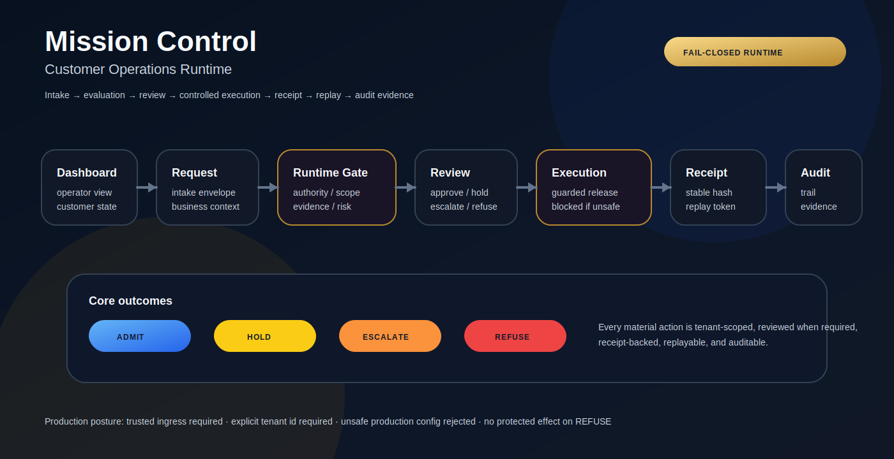

# Mission Control: Customer Operations Runtime

Mission Control is a production-candidate customer-operations runtime for controlled execution. It implements structured workflow intake, evidence-aware review, fail-closed execution gating, authentication/RBAC, receipts, replay, audit verification, persistent proof bundles, API boundary controls, and dashboard observability.

This is built as a Forward Deployed Engineering portfolio system: a customer-facing application that turns ambiguous operational requests into structured, reviewable, executable workflows.

## Claim boundary

Mission Control is:

- a customer-ops execution-control runtime
- a buyer-demo and production-candidate operational boundary system
- a runtime for intake, review, execution gating, receipts, replay, audit, proof export, and dashboard visibility
- not production certified until customer security approval, external review, or equivalent written deployment authorization

See:

- `docs/claims-boundary.md`
- `DEPLOYMENT_READINESS.md`
- `docs/threat-model.md`

## Visual demo



Recommended GIF path:

```text
assets/demo-walkthrough.gif
```

Recommended capture path:

```text
Dashboard -> request intake -> runtime decision -> review -> execution -> receipt -> replay -> audit verification -> proof bundle -> dashboard
```

Run the local walkthrough:

```bash
docker compose up --build
python scripts/local_demo_walkthrough.py
```

Full demo instructions:

- `docs/local-demo-walkthrough.md`

## Why this system matters

Customer operations often fail at the boundary between approval and execution. A request may look valid at intake, but become unready before the action is released.

Mission Control makes that boundary explicit:

- removes ambiguity from customer operations
- evaluates authority, scope, evidence, risk, and review requirements
- prevents unauthorized actions from executing silently
- creates replayable receipts for operational decisions
- verifies audit and proof artifacts
- gives teams a dashboard for intake, review, execution status, audit, replay, and proof state
- provides a deployable pattern for high-assurance customer operations

## Current state

This repo includes an end-to-end runtime with:

- FastAPI backend
- SQLAlchemy persistence
- SQLite default database for local development
- PostgreSQL production path tested in CI
- customer and workflow APIs
- request evaluation API
- evidence attachment API
- review action API
- controlled execution endpoint
- persisted receipt endpoint
- persisted replay endpoints
- audit trail endpoint
- audit ledger verification endpoint
- signed proof bundle export and verification endpoints
- metrics endpoint
- monitoring profile endpoint
- correlation ID middleware
- API body-size controls
- API rate-limit controls
- dashboard API
- Next.js frontend dashboard
- Docker Compose deployment
- production configuration validation
- trusted-ingress requirement in production mode
- tenant-header requirement in production mode
- schema versioning and Alembic migrations
- GitHub Actions CI with SQLite and PostgreSQL backend coverage
- CodeQL workflow
- deployment certification repository gate
- smoke test script
- local demo walkthrough script
- end-to-end API tests

## Tech stack

```text
Backend: FastAPI, Python 3.11, Pydantic
Persistence: SQLAlchemy, SQLite local development, PostgreSQL production path tested in CI
Frontend: Next.js, React, TypeScript
Deployment: Docker, Docker Compose
Testing: pytest, FastAPI TestClient, smoke test script, local walkthrough script, SQLite CI, PostgreSQL CI
Operations: CORS, correlation IDs, structured request logging, metrics endpoint, monitoring profile, API boundary controls
```

## Architecture

```text
Customer Operator
    |
    v
Next.js Dashboard
    |
    v
FastAPI Operations API
    |
    +--> Customer + Workflow Registry
    +--> Request Intake
    +--> Evidence Attachment
    +--> Runtime Policy Gate
    +--> Review / Escalation
    +--> Controlled Execution Guard
    +--> Receipt Service
    +--> Replay Service
    +--> Audit Trail + Ledger Verification
    +--> Proof Bundle Store
    +--> Metrics + Monitoring + Dashboard
    |
    v
SQLAlchemy Persistence Layer
```

## Operational path

```text
customer
  -> workflow
  -> request intake
  -> persisted request
  -> runtime decision
  -> evidence manifest
  -> review action
  -> controlled execution
  -> receipt
  -> same-condition replay
  -> changed-condition replay
  -> audit ledger verification
  -> proof bundle verification
  -> monitoring profile
  -> dashboard
```

## Concrete lifecycle example

### Scenario

Customer requests a time-bound operational exception.

### Intake JSON

```json
{
  "customer_id": "demo-customer",
  "workflow_id": "operations-exception",
  "request_id": "REQ-OPS-001",
  "requested_action": "approve_time_bound_operations_exception",
  "business_context": "Operator requests a temporary exception for a defined workflow condition.",
  "authority_present": true,
  "scope_matched": true,
  "evidence_present": true,
  "evidence_fresh": true,
  "risk_level": "critical",
  "approval_required": true,
  "metadata": {
    "case_id": "CASE-1042",
    "requested_duration_minutes": 30
  }
}
```

### Lifecycle

```text
1. Request submitted
2. Runtime detects elevated risk
3. Outcome: ESCALATE
4. Lifecycle status: pending_approval
5. Evidence attached
6. Reviewer approves
7. Lifecycle status: approved_for_execution
8. Controlled execution endpoint releases the action
9. Receipt generated
10. Same-condition replay matches
11. Changed-condition replay refuses inherited authorization posture
12. Audit ledger verifies
13. Proof bundle verifies
14. Monitoring profile summarizes operational state
15. Dashboard summarizes runtime state
```

## What this system does

1. Customer submits an operational request.
2. System creates a structured request envelope.
3. Evidence and context can be attached.
4. Runtime policy evaluates readiness and risk.
5. Review routing determines whether human action is required.
6. Outcome becomes `ADMIT`, `HOLD`, `ESCALATE`, or `REFUSE`.
7. Controlled execution is blocked unless lifecycle state permits release.
8. Receipt is generated.
9. Replay verifies same-condition and changed-condition behavior.
10. Audit trail records material events.
11. Audit ledger verification checks event linkage.
12. Proof bundle export ties request, evidence, decision, receipt, replay, and audit artifacts together.
13. Monitoring profile exposes operational state and incident handoff fields.
14. Dashboard exposes operational state.

## Example use cases

- Vendor onboarding
- Payment approvals
- Security exceptions
- Change management
- Customer operations
- Compliance workflows
- AI-assisted operational decisions
- Operational exception review
- Production change approval

## Forward Deployed Engineering Signals

- Customer workflow intake
- FastAPI backend
- Production-oriented API design
- Structured request schemas
- Runtime policy gate
- Review and escalation logic
- Controlled execution guard
- Receipt and replay system
- Persistent audit trail
- Signed proof export
- Dockerized deployment
- Frontend dashboard
- Customer discovery docs
- Seeded demo cases
- CI and tests
- Deployment readiness package
- Claims-boundary discipline

## Quickstart: Docker

```bash
docker compose up --build
```

Open:

```text
Frontend: http://localhost:3000
API docs: http://localhost:8000/docs
Health: http://localhost:8000/health
Metrics: http://localhost:8000/metrics
Monitoring: http://localhost:8000/ops/monitoring
```

Run the scripted local walkthrough:

```bash
python scripts/local_demo_walkthrough.py
```

The walkthrough exercises decision, evidence, review, execution, receipt, replay, audit verification, proof bundle verification, and dashboard state.

## Quickstart: backend only

```bash
cd backend
python -m venv .venv
source .venv/bin/activate  # Windows: .venv\Scripts\activate
pip install -r requirements.txt
python scripts/seed_demo_data.py
uvicorn app.main:app --reload
```

Run demo cases:

```bash
python scripts/run_demo_cases.py
```

Run smoke test while API is running:

```bash
python scripts/smoke_test.py
```

Run tests:

```bash
pytest -q
```

## Quickstart: frontend only

```bash
cd frontend
npm install
npm run dev
```

Set API base if needed:

```bash
NEXT_PUBLIC_API_BASE=http://127.0.0.1:8000
```

## Security and integrity posture

Implemented controls include:

- Every evaluated request produces a decision record.
- Receipt payloads include stable hashes for replayable verification.
- Same-condition replay verifies deterministic decision behavior.
- Changed-condition replay proves prior authorization posture is not silently inherited.
- Review actions are recorded in the audit trail.
- Controlled execution is blocked unless lifecycle state permits release.
- `REFUSE` blocks protected effect release.
- Correlation IDs are returned on API responses for traceability.
- Request logs include method, path, status, duration, and correlation ID.
- Production mode requires trusted ingress.
- Production mode requires an explicit tenant header.
- Unsafe production configuration is rejected at startup.
- Authentication and RBAC protect runtime actions.
- Request snapshots and evidence manifests are hashed.
- Receipts are signed and externally verifiable.
- Audit ledgers are hash-chained and verifiable.
- Proof bundles are signed and verifiable.
- API body-size and rate controls protect the API boundary.
- Runtime signing keys support current and verify-only previous values.
- Monitoring profile exposes operational probes, counters, alerts, and incident handoff fields.
- PostgreSQL migrations and backend tests run in CI.
- Deployment certification gate separates repository readiness from production certification.

Remaining production-readiness work includes:

- distributed limiter or gateway enforcement for multi-instance deployments
- customer deployment approval and external review

## Core outcomes

- `ADMIT`: request may proceed under current conditions.
- `HOLD`: request needs more evidence, scope review, or correction.
- `ESCALATE`: request requires higher authority or approval.
- `REFUSE`: request cannot proceed and no protected effect is released.

## Deployment readiness checker

Run the readiness checker in report mode:

```bash
python scripts/check_deployment_readiness.py
```

Run it in strict mode when the remaining production-readiness package is expected to be complete:

```bash
python scripts/check_deployment_readiness.py --strict
```

Run the deployment certification repository gate:

```bash
python scripts/certify_deployment.py --repo-check-only
```

Run the certification gate only with completed approval evidence:

```bash
python scripts/certify_deployment.py --certify --evidence-file <completed-evidence-file>
```

## Future extensions

- AI-assisted triage for incoming customer requests
- LLM-based evidence summarization
- multi-agent escalation routing
- human-in-the-loop approval queues
- integration with mission-critical systems
- policy packs per customer or workflow type
- deployment profiles for cloud environments
- distributed proof store

## Key docs

- `DEPLOYMENT_READINESS.md`
- `docs/claims-boundary.md`
- `docs/threat-model.md`
- `docs/end-to-end-runbook.md`
- `docs/operations-runbook.md`
- `docs/schema-versioning.md`
- `docs/trusted-ingress-identity.md`
- `docs/api-security.md`
- `docs/audit-ledger.md`
- `docs/persistent-proof-store.md`
- `docs/key-management.md`
- `docs/monitoring-profile.md`
- `docs/incident-response.md`
- `docs/postgres-ci.md`
- `docs/deployment-certification-gate.md`
- `docs/local-demo-walkthrough.md`
- `docs/deployment-evidence-template.md`
- `docs/release-checklist.md`
- `docs/customer-discovery.md`
- `docs/architecture.md`
- `docs/completeness-checklist.md`
- `docs/fde-demo-script.md`

## Production hardening roadmap

The remaining production-readiness work is tracked in GitHub issue #27 and includes:

- distributed limiter or gateway enforcement for multi-instance deployments
- customer-approved storage, retention, and backup policy
